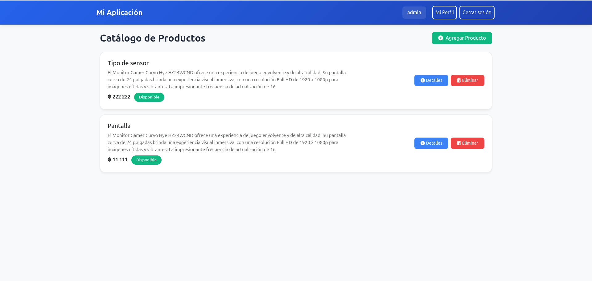
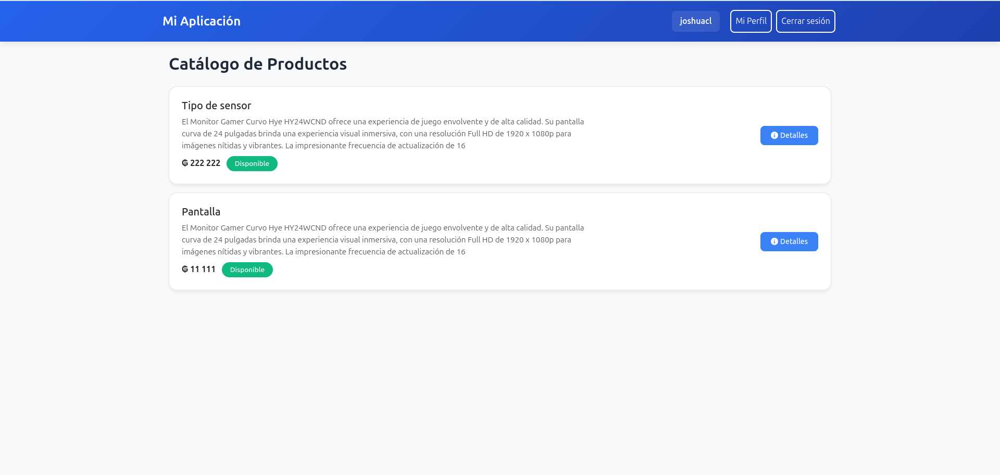
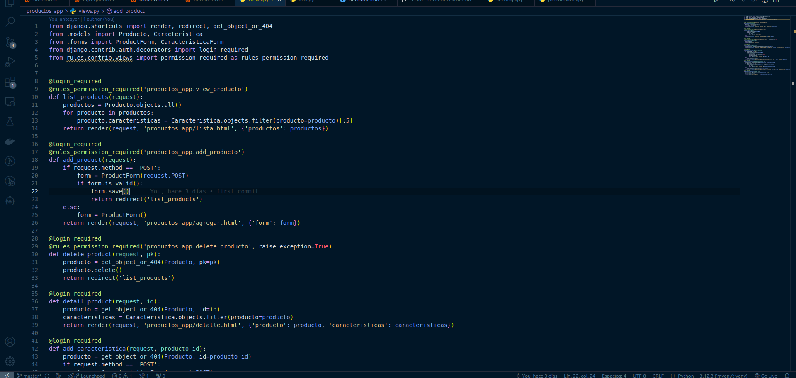
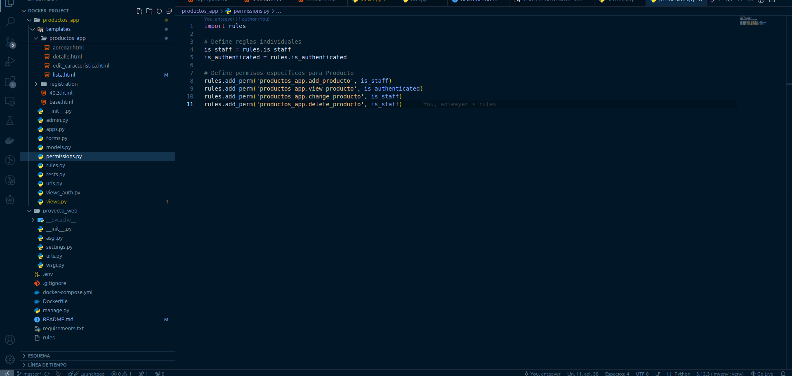
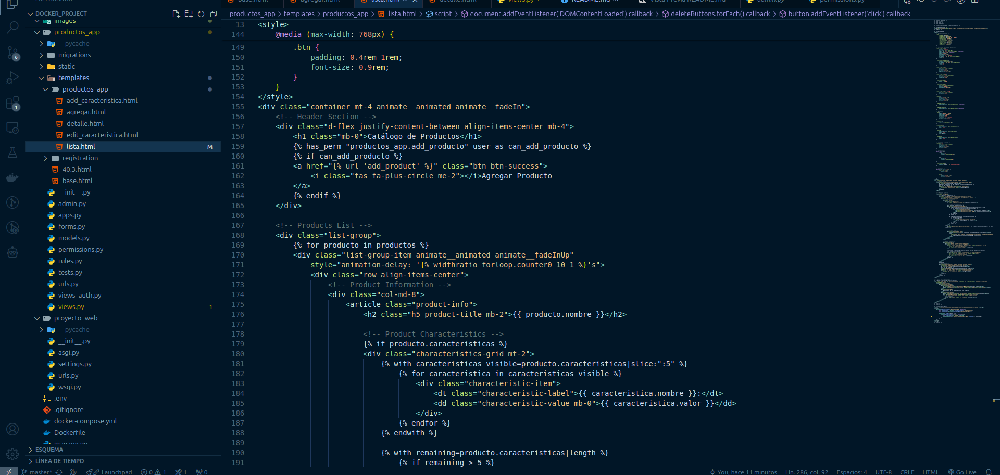

# Inventario básico con django-rules

[](https://python.org)
[](https://developer.mozilla.org/es/docs/Web/HTML)
[](https://developer.mozilla.org/es/docs/Web/CSS)
[](https://developer.mozilla.org/es/docs/Web/JavaScript)

Pagina web de gestión de un inventario de productos hecha utilizando [Python](https://python.org), [Django](https://www.djangoproject.com/), [bootstrap](https://getbootstrap.com/) y [Postgresql](https://www.postgresql.org/). La aplicación permite listar, agregar y eliminar productos, agregarles una descripción y marcar como disponibles o no disponibles, ademas se puede agregar mas de una caracteristicas a los productos, todo esto teniendo el rol de Administrador.
Se tienen dos roles de usuario utilizando Django-rules https://github.com/dfunckt/django-rules, el rol de administrador y el rol de usuario, siendo el rol de administrador el que te permite realizar todo el crud del inventario.

## Tecnologías Utilizadas

- **Backend**: Django 5.1
- **Frontend(Templates)**: HTML, CSS, JavaScript
- **Base de Datos**: PostgreSQL 
- **Otros**: Bootstrap 5, Django-rules

## Requisitos
Es fundamental contar con estos requisitos para poder correr el proyecto:
- Docker
- Docker Compose

## Instrucciones para Ejecutar el Proyecto

1. Ingresa al repositorio:
   ```
   cd docker_project
    ```
2. Ejecuta los comandos en una terminal
    ```
    docker compose build 
    ```
3. Realiza las migraciones correspondientes
    ```
    docker compose run web python manage.py migrate
    ```
4. Puedes crear un super usuario (Opcional), en caso de que quieras manipular los datos desde el admin de Django
    ```
    docker compose run web python manage.py createsuperuser
    ```
6. Finalmente, correremos el proyecto en el puerto 8000
    ```
    docker compose up 
    ```
6. Accede al localhost

    ```
    http://127.0.0.1:8000/
    ```

7. En caso de tener problemas de permisos, ejecuta los siguientes comandos y luego vuelve a ejecutar los anteriores

    ```
    sudo usermod -aG docker $USER
    ```
    ```
    exec su -l $USER
    ```
    

## Una vez aquí se pueden realizar todas las acciones que permite la aplicación

### El administrador tiene acceso a la lista de productos, puede agregar mas productos, o bien, ver los detalles o eliminar productos


### El usuario solo puede observar con los productos disponibles


### Se importó el decorador permission_required bajo el alias de rules_permission_required, utilizandolo con los rules del archivo permissions.py


### El archivo permissions.py declara las reglas que se aplicaran a los metodos de views


### Una muestra de como utilizar los rules en jinja2
